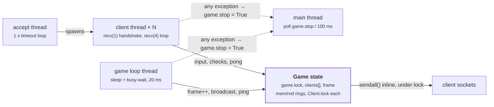
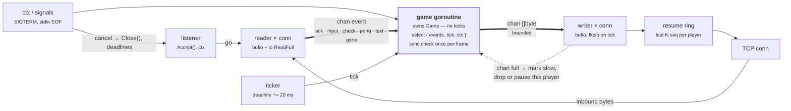
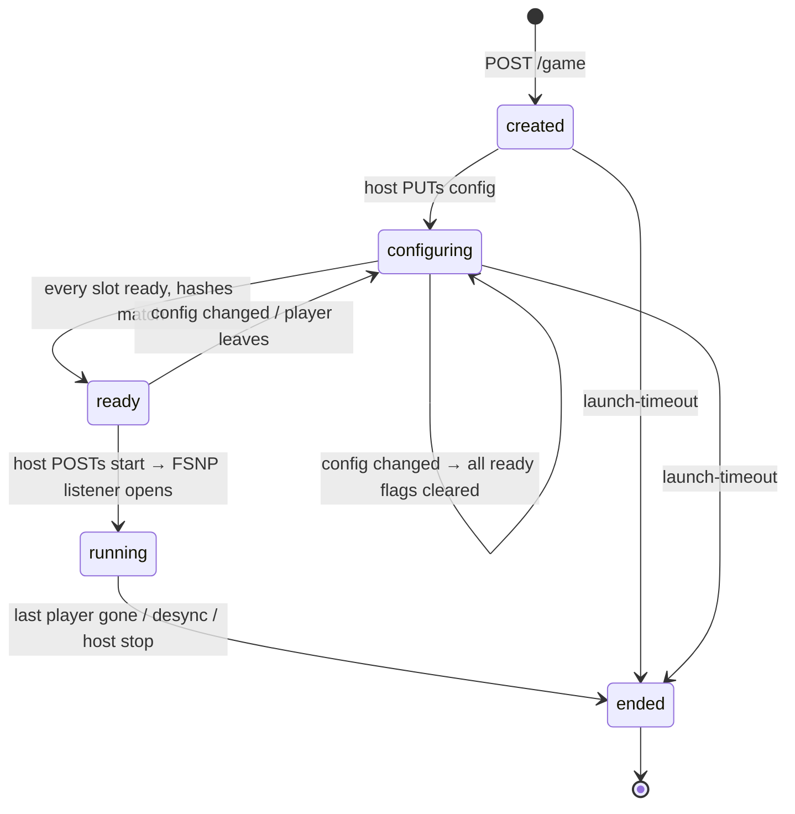

# FSNP Server in Go

Design proposal for replacing the Python netplay game server in `launcher/server/game.py` with a static Go binary that speaks the same wire protocol, isolates client failures, reconnects players, and can host many games from one process.

| | |
|---|---|
| **Status** | In progress — single-game server built (steps 4–5) and verified in a real two-player FS-UAE session (step 6); next is the launcher spawn path (step 7) |
| **Date** | 2026-09-13 |
| **Protocol** | FSNP v1, byte-compatible |
| **Scope** | server + launcher spawn path; one small fix to the emulator client, reconnect later |
| **Client source** | `fs-uae/libfsemu/src/emu/netplay.c` — `v3.1.66` (branch `fs-uae-3.1`, what's played today) and master `fd6fa3656` |

## Contents

1. [Summary](#summary)
2. [How it works today](#how-it-works-today)
3. [The wire contract](#the-wire-contract)
4. [What the C client actually does](#what-the-c-client-actually-does)
5. [What breaks](#what-breaks)
6. [Proposed Go design](#proposed-go-design)
7. [Design details](#design-details)
8. [Launcher integration](#launcher-integration)
9. [Future: the session owns the config](#future-the-session-owns-the-config)
10. [Repository layout](#repository-layout)
11. [Go package layout](#go-package-layout)
12. [Rollout](#rollout)
13. [Risks](#risks)

## Summary

The current server is a 760-line Python script that runs one game per process, spawned by re-executing the whole launcher. It works, but a single client hiccup kills the session for everyone, reconnect is stubbed, and the 50 Hz tick competes with reader threads for the GIL. None of that is inherent to the protocol — it's the process and threading model.

The proposal keeps **FSNP v1 byte-identical** (FS-UAE's C client is the fixed party) and changes what's behind the socket: a game goroutine that owns all state, per-connection reader and writer goroutines talking to it over channels, a deadline-based ticker, and an optional HTTP lobby so the Docker image can host more than one fixed game.

> **Found while reading the C client:** the emulator actually played today (`v3.1.66`, branch `fs-uae-3.1`) matches `game.py` exactly. But the fork's **master** renumbered the extended-message commands in June 2025 (`fd6fa3656`, "Allow 8 players + 1 spectator/streamer") without touching `game.py`. Against a master build the Python server's first post-handshake word is an unknown command and the emulator disconnects. The Go server needs to decide which numbering it speaks — see [What the C client actually does](#what-the-c-client-actually-does).

> **Decided:** target `v3.1.66` — it's the released version, and what both people actually running netplay sessions here use today. Master's 9-player renumbering isn't a live decision to make; it only becomes relevant if a client build newer than `v3.1.66` enters use, at which point it needs a deliberate protocol-version bump, not a silent break. The Go server ships as a static binary next to the launcher, with the lobby API and multi-game hosting as a second phase. Reconnect needs client-side work and is scoped as a third phase.

## How it works today

Hosting from the launcher (`/hostgame`) picks a free port from 25102–25500, re-executes `sys.executable + sys.argv + --server`, sleeps two seconds, and opens a window whose close button calls `process.kill()`. The Docker image runs the same script standalone on port 25101 with a fixed player count.

Inside the process there are four kinds of thread sharing two locks:



Readers and the tick both mutate one shared `Game` under locks, and sends happen inline from whichever thread holds the lock. The dashed edges are the failure path — an exception anywhere stops the game for every player.

## The wire contract

This is the part that must not change. The emulator's netplay client (`libfsemu/src/emu/netplay.c` in the fs-uae repo) speaks it, and every quirk below is observable from the other side of the socket.

### Handshake

TCP with `TCP_NODELAY`. The first four bytes are either `PING` (server replies `PONG` and closes — this is what `ConnectionTester` uses) or `FSNP` followed by:

| Bytes | Field | Notes |
|------:|-------|-------|
| 1 | protocol version | must equal `1`, else `ERROR_PROTOCOL_MISMATCH` |
| 4 | password hash | `sha1("FSNP" + ascii_only(password))[:4]`, big-endian. Non-ASCII characters are silently dropped. |
| 8 | emulator version | player 0 sets the reference; others must match or get `ERROR_EMULATOR_MISMATCH` |
| 3 | session key | 24-bit; server assigns on first join, checked on rejoin |
| 1 | player | `0xFF` = new player, else slot to resume |
| 3 | tag | three ASCII bytes, default `PLY` |
| 4 | resume-from-packet | outbound sequence to replay from; today always rejected if > 0 |

The server then queues `SESSION_KEY`, `PLAYERS` (`player << 8 | num_players`), and one `PLAYER_TAG_n` per connected player, and flushes.

### Message words

After the handshake, both directions are a stream of 32-bit big-endian words. The top three bits select the kind:

```
bit   31 30 29 28 ........ 24 23 ............................ 0
      ┌──┬──────────────────┬────────────────────────────────┐
ext   │ 1│   command (7)    │           data (24)            │
      └──┴──────────────────┴────────────────────────────────┘
      ┌──┬──┬──────────────────────────────────────────────────┐
frame │ 0│ 1│              frame number (30)                   │
      └──┴──┴──────────────────────────────────────────────────┘
      ┌──┬──┬──┬───────────────┬────────────────────────────────┐
input │ 0│ 0│ 1│    unused     │        input event (24)        │
      └──┴──┴──┴───────────────┴────────────────────────────────┘
```

Server → client frame words are the tick; client → server frame words are acks. `MESSAGE_TEXT` is the only variable-length message: its 24-bit data carries the byte count of a payload that follows immediately.

Extended commands. `game.py` and the played emulator (`v3.1.66`) agree; the fork's **master** diverges from 15 upward:

| Command | `game.py` = `netplay.c` @ `v3.1.66` | `netplay.c` @ master `fd6fa3656` | Client handles it? |
|---------|----:|----:|---|
| `READY` | 0 | 0 | no |
| `MEM_CHECK` | 5 | 5 | sends only |
| `RND_CHECK` | 6 | 6 | sends only |
| `PING` | 7 | 7 | replies with `PING 0` |
| `PLAYERS` | 8 | 8 | yes |
| `PLAYER_TAG_0..5` | 9–14 | 9–14 | yes |
| `PLAYER_TAG_6..8` | — | 15–17 | yes |
| `PLAYER_PING` | 15 | **18** | yes |
| `PLAYER_LAG` | 16 | **19** | yes |
| `SET_PLAYER_TAG` | 17 | **20** | no |
| `PROTOCOL_VERSION` | 18 | **21** | no |
| `EMULATION_VERSION` | 19 | **22** | no |
| `ERROR` | 20 | **23** | warns, disconnects |
| `TEXT` | 21 | **24** | yes |
| `SESSION_KEY` | 22 | **25** | stores it |
| `HALT` | 23 | 26 | no |

Any command the client doesn't handle falls through to "unknown (ext) message" and it **disconnects**. `MAX_PLAYERS` is 6 on `v3.1.66` and 9 on master.

**Confirmed by diff, not inferred: `FS_EMU_NETPLAY_PROTOCOL_VERSION` is `1` on both branches** — the renumbering shipped without touching the version byte the client sends in the handshake (`data[4]`, checked in `game.py` with strict equality). So a server genuinely cannot tell which command table a connecting client expects; the handshake carries no signal for it. The only other version-shaped data on the wire is the 8-byte emulator version (major/minor/revision from `PACKAGE_MAJOR/MINOR/REVISION`), which exists to reject *mismatched* players joining the same game, not to negotiate protocol — using it to guess the command table would mean hardcoding a table of known release numbers into the server, which breaks the moment someone builds from a different point in history.

The Go server should ship speaking the `v3.1.66` column — that's what players run and what `game.py` has always sent. The master renumbering is a real protocol change hiding behind an unchanged version byte; the clean way to adopt it is to bump `FS_EMU_NETPLAY_PROTOCOL_VERSION` to 2 on master (a one-line, one-character change), have the Go server accept both versions in the handshake, and select the command table per connection on that byte. Silently renumbering, as master does now, breaks every existing server with no way for the server to even detect the mismatch — it just watches an unexplained disconnect.

### Behaviour the client can observe

- Server sends a frame word every 20 ms and flushes each client's queue on that tick; other queued words ride along. A queue also auto-flushes at 100 entries.
- Input events are broadcast to **all** players, including the sender. The emulator relies on the echo.
- Ping every 10 frames; `PLAYER_LAG` and `PLAYER_PING` status for every player every 100 frames.
- Mem/rnd checksum words are tagged with the client's most recent frame ack; once every client has passed frame *f*, the values for *f* are compared.
- If any client falls more than 25 frames behind, the server stops advancing until it catches up.

## What the C client actually does

`libfsemu/src/emu/netplay.c` is ~870 lines and, apart from the command renumbering and three extra `PLAYER_TAG` handlers on master, is identical between `v3.1.66` and master. The parts that constrain the server are below; line numbers are from `v3.1.66`.

### Per-frame sequence (`fs_emu_netplay_wait_for_frame`, lines 369–467)

The emulator thread blocks on a condition variable until the receive thread has seen a server frame word ≥ the frame it wants. It then sends, in this order: `RND_CHECK` (24-bit checksum), `MEM_CHECK` (24-bit checksum), then the frame ack `FRAME | frame`. So on the server, checksum words for frame *f* arrive **before** the ack for *f*, while the client's recorded frame is still *f−1*. The Python server tags them with `client.frame` at arrival — i.e. *f−1* — and compares across clients at that index. The Go server must keep that attribution rule exactly, or every game will desync-fail on frame 1.

Input events received from the server are queued with the frame word acting as a sentinel; when the emulator processes frame *f* it drains the queue up to the sentinel for *f*. If the sentinel's frame doesn't match, the client calls `exit(1)`. Frame words therefore must be sent in order, exactly once each, and every input event for a frame must precede that frame's word — which the Python server's "queue then flush on tick" ordering guarantees and the Go writer must too.

### Stalls are tolerated

The condvar wait loops with 100 ms timeouts for as long as it takes, checking only for quit and for the "Abort" button on the pre-frame-1 dialog. A server pause — drift stall today, reconnect grace window later — simply freezes the emulator. No timeout, no error.

### Disconnect is terminal (lines 261–299)

On any socket error, on `MESSAGE_ERROR`, or on an unknown command, the client goes to "offline mode" and never reconnects. `g_fs_emu_netplay_resume_at_packet` is initialised to 0 and never written; `g_fs_emu_netplay_session_key` is stored but never used. **Server-side resume is dead code until the client is changed.**

### Text messages

`TEXT` data is `from_player << 16 | len`, so `len` is 16-bit and the server must not let a payload exceed 65 535 bytes or the length corrupts the sender field. The client only keeps `FSE_MAX_CHAT_STRING_LENGTH` = 128 bytes and drains the rest byte-by-byte. Messages from the sender's own player number are dropped on receipt (already echoed locally), so the server's broadcast-to-all is correct.

### Handshake bytes (lines 726–765)

Confirmed identical to the server's parse: `FSNP`, version, 4 password bytes, 8 emulator-version bytes (`"FSUAE"` + major, minor, revision), 3-byte session key, player byte (`-1` → `0xFF`), 3-byte tag (`UNK` if unset; the launcher sets `netplay_tag`), 4-byte resume-from-packet. The password is the first 4 bytes of the same SHA-1 the server computes, ASCII-only filtering included.

### Client bugs that constrain the server

| | Where | Effect | Fix |
|---|---|---|---|
| **C1** | `receive_thread`, line 645: `if (bytes_read == 4)` should be `if (count == 4)` | A 4-byte word split across two `recv` calls is silently dropped, `count` reaches 4, and the next `recv(…, 0, …)` returns 0 → treated as disconnect. Rare on a LAN, likely on the internet when a flush straddles a segment boundary. | Root cause is a one-word change in the client — not made; out of scope here, this project doesn't touch fs-uae's C source. **Mitigated server-side instead:** `Client.__send_data` in `game.py` now caps every `sendall()` at `MAX_SEND_CHUNK` (1,400 bytes), splitting larger flushes rather than handing the OS one large buffer likely to fragment across a segment boundary. Reduces the chance of triggering C1; doesn't eliminate it — the bug is still live in the client for any large enough send from any server. |
| **C2** | No reconnect path | Any blip ends netplay for that player permanently. | Client work: on error, reconnect with stored session key + player number + last received sequence, then let the server replay. |
| **C3** | `wait_for_frame` before frame 1 shows a dialog with only "Abort" | Fine — but the server should send a `TEXT` or status word when waiting on stragglers so the host knows who hasn't joined. | Optional; server can do this without client changes. |

### Verified against a captured session

A real two-player capture (loopback, two `fs-uae v3.1.66` instances against `game.py`, ~6,168 frames / ~2 minutes) turns several of the claims above from "derived by reading source" into "observed in production traffic":

- **Emulator version in the handshake reads `FSUAE` `03 01 42`** — literally 3.1.66 — independently confirming this session, and the earlier branch inspection, are the same build.
- **Command numbers on the wire are the `v3.1.66`/`game.py` column, not master's.** `SESSION_KEY` arrives as ext command `22`, `PLAYER_PING`/`PLAYER_LAG` as `15`/`16` — exactly as documented, and as expected since nothing on the wire could select otherwise (see [Command numbers don't match the emulator](#the-wire-contract) above).
- **The RND_CHECK → MEM_CHECK → FRAME send order holds for every single one of 6,164 cycles**, no exceptions — confirming the ordering claimed from reading `wait_for_frame` is real, not just what the source implies.
- **Frame-attribution is exactly right.** Tagging each checksum with the *previous* acked frame and comparing across clients at that index produces **zero mismatches across all 6,164 common frames** for this session — the invariant the sync check depends on holds in practice, and this capture is now a ready-made regression fixture for it.
- **A quirk not obvious from source alone: tag-broadcast count depends on join order.** Player 0 (joined first) receives its own `PLAYER_TAG_0` twice (once from `send_player_tags` at its own connect, again from the loop-start broadcast in `__game_loop`) but `PLAYER_TAG_1` only once. Player 1 (joined second) receives *both* tags twice — once from its own connect-time `send_player_tags` (which now sees both clients) and again from loop start. Harmless (the client just overwrites), but a Go rewrite that "simplifies" tag broadcasting into a single clean call per join will silently change this — worth keeping as an explicit test case rather than rediscovering it as a diff against real traffic.
- **Correcting an early misreading on my part:** a narrow first look made `MEM_CHECK` appear to be a suspicious constant. It isn't — both instances report an honestly zero checksum for the first 16 frames (RAM genuinely unwritten during early boot), then diverge into normal-looking varying values that still match exactly between the two clients frame-for-frame.
- **Client bug C1 doesn't reproduce here, as predicted.** Every one of the ~20,000 client→server payloads is exactly 4 bytes (the client never batches sends); every server→client payload is a multiple of 4 bytes even when coalesced up to 28 bytes (7 words) in one segment. No word is ever split across a TCP segment on loopback, so this capture can't exercise C1 — that still needs a real, imperfect network, not a local one.

The application-layer bytes behind these findings are committed at [fsnp-server/internal/fsnp/testdata/](../fsnp-server/internal/fsnp/testdata/) for reuse as golden test data — see [docs/netplay-fixtures/README.md](netplay-fixtures/README.md) for what's in each file and why they live in the Go module rather than here.

## What breaks

These are the concrete problems the rewrite should fix. They're labelled so the proposal can point back at them.

| ID | Problem | Where |
|----|---------|-------|
| **W0** | **Command numbers diverge between the two forks' branches.** `game.py` matches `v3.1.66`, but fs-uae master shifted `PLAYER_PING` and everything after it by +3 behind the same protocol-version byte. Against a master build, `game.py`'s `SESSION_KEY` (22) is read as `EMULATION_VERSION`, unhandled, and the emulator disconnects. Not a live break today; a trap for the next emulator release. | `game.py:97-104` vs master `netplay.c:121-130` |
| **W1** | **One failure ends the game for everyone.** A client thread exception sets `game.stop`. A client that disconnects returns silently from `receive_loop` (the `# FIXME`), stays in `clients[]` with `playing=True`, and the next `sendall` to its dead socket raises inside the game loop — same outcome. | `game.py:280-282`, `game.py:294-296` |
| **W2** | **Reconnect is stubbed.** Session keys are issued and verified, but `resume_from_packet > 0` always returns `ERROR_CANNOT_RESUME` and nothing buffers outbound bytes, so replay is impossible. | `game.py:436-445` |
| **W3** | **The tick is hostage to the GIL.** The loop sleeps to 1 ms before the deadline and then busy-waits, starving the reader threads. Reader threads contend with the tick in turn; that jitter appears directly as the `lag` figure players see. | `game.py:486-498` |
| **W4** | **Byte-at-a-time I/O.** The handshake reads with `recv(1)` per byte; the message loop issues a syscall per 4-byte word. | `game.py:214-220`, `game.py:289-302` |
| **W5** | **Module-global state.** `game`, `num_clients`, `game_password` and `port` are globals; `Game.check_synchronization` uses the global `game` instead of `self`. This is why a process can only ever run one game. | `game.py:56-65`, `game.py:617-656` |
| **W6** | **No clean shutdown.** Non-daemon threads blocked in `recv` keep the process alive after `run_server` returns, so the launcher must `kill()` it. `launch_timeout` counts from the last *connection*, not from start. | `game.py:714-721`, `Server.py:27-31` |
| **W7** | **Lock ordering is by convention.** `game.lock → Client.lock` is nested in `__send_to_clients` and `send_ping`. The reverse nesting doesn't occur today, but nothing checks it. | `game.py:500-509` |
| **W8** | **No readiness signal, no structured logs.** Everything is `print`. The launcher's own comment says it should read stdout instead of `sleep(2.0)`. | `Server.py:22-24` |
| **W9** | **Handshake has no deadline; text length unbounded.** A half-open connection holds a reader thread forever. `MESSAGE_TEXT` accepts up to 16 MB per message. | `game.py:348-359` |
| **W10** | **Deployment mismatch.** The Docker image runs one fixed-size game on 25101, but `/startgame` expects an HTTP `/game/create` lobby API on that port — a service that isn't in this repo. The Dockerfile's `iconv` step writes to stdout and changes nothing. | `netplay.py:473`, `Dockerfile` |

## Proposed Go design

The organising rule: **one goroutine owns each game's state, and everything else talks to it over channels.** No mutex guards game state, so W1, W5 and W7 disappear by construction and `go test -race` keeps them gone.



State lives in one goroutine; readers and writers are per-connection and disposable. A dead or slow connection surfaces as an event or a full channel, and the game goroutine decides what to do with *that* player. Nothing blocks the tick.

| | Today | Proposed |
|---|---|---|
| Concurrency | Thread per client + game loop + accept + main | Goroutine per connection direction + one game goroutine |
| State | Shared `Game` under two locks | Owned by one goroutine, channels in/out |
| Sending | Inline `sendall()` under the lock | Non-blocking channel write, flushed by writers |
| Failure | Exception anywhere → stop everything | Connection failure is a per-player event |
| Exit | Needs `kill()` | `context` cancel; process exits on its own |

Addresses W1, W3, W4, W5, W6, W7.

## Design details

### Protocol package with golden tests

`internal/fsnp` holds the constants (the `v3.1.66` numbering, `MAX_PLAYERS = 6`; the master table behind a protocol-version switch when that's bumped), `type Message uint32` with `IsExt()`, `Command()`, `Data()`, `IsFrame()`, `IsInput()`, an `encoding/binary.BigEndian` codec, `PasswordHash(string) uint32`, and `ReadHandshake(io.Reader)`. *(W0)*

**Fixtures don't need a captured session to get started — they're generated straight from the existing source.** `create_game_password`, `create_ext_message` and `int_to_bytes` in `game.py` are pure functions; a small script imports `game.py` and runs them over a matrix of inputs (empty/ASCII/non-ASCII passwords, every player/tag/command combination) to produce exact golden vectors — e.g. `create_game_password("secret")` → `bd2ec2ea`, checked directly against a running interpreter, not assumed. The handshake byte layout is likewise fixed-offset construction with no runtime branching (`fs_emu_netplay_connect`, `netplay.c` lines 726–765), so it's transcribed by reading, not captured. This is more thorough than a single pcap for edge cases (wrong password, oversized text, every extended command) a happy-path two-player session would never produce on its own.

A real capture (see [Verified against a captured session](#what-the-c-client-actually-does) above) is complementary, not a substitute. The application-layer bytes from it — both handshakes, both directions of both connections, ~6,164 frames of RND/MEM_CHECK pairs with known-correct cross-client attribution and zero mismatches — are extracted and committed at [fsnp-server/internal/fsnp/testdata/](../fsnp-server/internal/fsnp/testdata/), the only copy (the raw pcap itself isn't committed anywhere; it's 30× larger and mostly TCP/IP framing and unrelated traffic). [docs/netplay-fixtures/](netplay-fixtures/) holds the human-readable manifest, README, and the `extract_fixtures.py` script that regenerates the testdata files from any similarly-captured session — not a second copy of the bytes. The codec is verified against both a hand-built matrix and one real session end to end.

### Writer discipline the client depends on

Because of the sentinel scheme in `wait_for_frame`, the writer for each connection must (a) emit every frame word exactly once and in order, (b) put all input events for frame *f* before frame word *f*, and (c) — until client bug C1 is fixed — never issue a `Write` larger than 1 400 bytes, so a word can't straddle a TCP segment. (a) and (b) fall out of a single game goroutine producing the byte stream; (c) is a check in the writer.

### Deterministic tick

A deadline loop — `next = next.Add(20 * time.Millisecond)`, sleep until `next` — rather than sleep-then-spin. Go's runtime timers are sub-millisecond on Linux and macOS, and Go ≥ 1.16 uses high-resolution timers on Windows. Not `time.Ticker`: it *skips* periods when a wakeup is late, where this loop fires the missed ticks back to back so no frame is lost — the same accumulation `game.py` got from `self.time = target_time`. The first real session (rollout step 6) ran on `time.Ticker` and lost 11 frames in 7.6 minutes that way. When a client is more than `maxDrift` frames behind, the loop keeps ticking but doesn't advance `frame`; pings, text and disconnect events keep flowing during the stall instead of the whole loop sleeping. *(W3)*

### Player loss without collateral damage (phase one)

The client can't reconnect today, so the first thing to get right is what happens to *everyone else* when one player drops. The game goroutine receives a `gone` event, marks the slot, broadcasts a `TEXT` word ("PLY2 disconnected") and `ERROR_GAME_STOPPED` to the remaining players, and shuts that game down cleanly — no traceback, no orphaned process, other games in the same daemon unaffected. *(W1)*

### Reconnect (phase three — needs client work)

The server-side half is straightforward and cheap to design in now: each writer keeps a ring of the last *N* outbound bytes indexed by sequence number (the sequence the client reports as `resume-from-packet`). A handshake with a valid session key for an occupied slot replays from that offset and swaps the connection in. On disconnect the game pauses for a grace window (30 s to start), broadcasts a `TEXT` word so the other players see "PLY2 reconnecting", then gives up with `ERROR_GAME_STOPPED`. Stalls are safe because `wait_for_frame` just waits.

The client half (C2) is the real work: on socket error, reconnect instead of going offline, sending the stored session key, player number and the count of words received so far. Until that lands, the session-key machinery stays as it is — issued, verified, unused. *(W2)*

### Many games per process, and the missing lobby

With `Game` a value rather than a global, a single daemon hosts many games. Phase one keeps one listener per game from a port pool, which is exactly what the launcher already assumes (25102–25500 in `netplay.py`). Phase two adds the small HTTP endpoint the `/startgame` path has been calling all along:

```
GET /game/create?players=2&password=secret
→ id=…&password=secret&port=25107&addresses=203.0.113.4
```

with `launch-timeout` reaping games nobody joins. The Docker image becomes a real netplay host rather than one fixed game. *(W5, W10)*

One shape decision to make here rather than later: a `Game` should be constructable *before* its FSNP listener opens, and hold more than FSNP state — see [Future: the session owns the config](#future-the-session-owns-the-config). It costs nothing in phase two and avoids a retrofit in phase four.

### Hardening

- `SetReadDeadline` of ~5 s on the handshake; a half-open socket can't hold a slot.
- Cap inbound `MESSAGE_TEXT` at 1 KB (the client only displays 128 bytes anyway); close the connection on overflow. Outbound length is 16-bit by protocol, so the cap also protects the `from_player` field.
- `crypto/subtle.ConstantTimeCompare` for the password — it's still a 32-bit clear-text hash fixed by v1, so document that rather than pretend otherwise. TLS or a real key exchange is a v2 protocol change and needs the C client.

*(W9)*

### Sync checking

Same semantics as today — checks tagged with the client's last-acked frame (they arrive *before* the ack, see the per-frame sequence above), verified once every client has passed it — but run on the game goroutine, so "once per frame, not once per client" (the existing FIXME) holds by construction. On mismatch, log every player's value for the offending frame, broadcast the desync error, and shut that game down cleanly without touching others.

One thing found while building it: `game.py` doesn't actually do what the paragraph above says. `__check_game` loops `while oldest_frame > verified_frame`, calls `check_synchronization(verified_frame + 1)`, and increments `verified_frame` regardless — but `check_synchronization` returns early, without comparing anything, if any client's frame is `<= check_frame`, which is always the case for the slowest client when `check_frame == oldest_frame`. In steady state (every client acks each frame within the tick) that's every frame: the Python server verifies frame 0 and then skips essentially all others, only ever comparing when a client acks two or more frames between ticks. The Go `checkGame` verifies tag *k* only once `k < oldestFrame()` and never advances past a frame it hasn't compared. `TestReplayCapturedSession` confirms the captured session passes every frame under the stricter rule, so this is a fix, not a behaviour change players could notice — but it does mean the Go server can report a desync the Python one would have let through.

### Observability

`log/slog` with `game`, `player` and `frame` fields on every line; a one-line JSON readiness event on stdout (below); an optional `/metrics` exposing frame, per-player lag, ping average and stall count — the same numbers `__print_status` dumps every 200 frames today. *(W8)*

## Launcher integration

The Python side changes in one place: `launcher/server/Server.py`. It stops re-executing the launcher and instead runs a bundled binary with the same flag names, so `netplay.py` and `ServerWindow.py` are untouched.

| Concern | Today | Proposed |
|---------|-------|----------|
| Spawn | `sys.executable + sys.argv + --server` (whole launcher, all imports) | `fsnp-server --port= --players= --password= --launch-timeout=`, static binary, `CGO_ENABLED=0`, cross-compiled per platform |
| Readiness | `time.sleep(2.0)` | Read stdout until `{"event":"listening","port":25102}` |
| Shutdown | `process.kill()` from the window's close handler | Close stdin or send `SIGTERM`; server cancels its context, sends `ERROR_GAME_STOPPED`, exits. `kill()` stays as the fallback after a timeout. |
| Docker | `python:3.13-alpine`, single game on 25101 | `FROM scratch`, ~5 MB, `PLAYERS`/`PASSWORD`/`PORT` env, lobby API in phase two |
| Packaging | Nothing extra — it's Python | A build step that compiles the Go binary for macOS/Windows/Linux and places it in the PyInstaller bundle |

### Locating the binary

Not hardcoded, not `$PATH`, not a user-facing settings field — the launcher already solves "find an external executable" for every emulator it runs, and the Go server should use the same mechanism rather than inventing a fourth option.

`fsgs/plugins/pluginexecutablefinder.py::PluginExecutableFinder().find_executable(name)` is what `FSUAE.start_with_args` calls to find `fs-uae` itself ([fsgs/amiga/fsuae.py:29](../fsgs/amiga/fsuae.py#L29)), and what every emulator driver calls for its own binary ([fsgs/drivers/gamedriver.py:85](../fsgs/drivers/gamedriver.py#L85)). It tries, in order: a sibling dev-project directory, `<base_dir>/System/<PluginName>/<OS>/<Arch>/` (then legacy `Plugins/` and `Data/Plugins/`), a side-by-side `.app` bundle on macOS, side-by-side the launcher's own executable, and a side-by-side plugin directory. Adding `fsnp-server` as a `known_executables` entry (e.g. `"fsnp-server": "FS-UAE-Netplay-Server"`) gets `Server.py` the packaged-build lookup, the per-OS/per-arch directory layout, and the `.exe` suffix on Windows for free — the same code path, same conventions, same failure mode (`None` → a clear "could not find executable" error) as `fs-uae` itself.

**One mismatch to resolve:** the dev-mode branch (`find_executable_in_development_project_dir`) assumes the plugin is a *sibling checkout* next to `fs-uae-launcher` — exactly how `fs-uae` sits next to this repo on disk today — not a directory nested inside it. That's in tension with putting `fsnp-server/` inside this repo (see below). Either move `fsnp-server` to its own sibling repo to match every other plugin exactly, or keep it nested and add one small dev-mode check in `Server.py` (or a corresponding branch in the finder) that looks at `fsnp-server/cmd/fsnp-server` relative to this repo's own root before falling through to the shared plugin-dir search. The latter keeps the "own top-level directory, own Go module" reasoning from the next section; the former buys perfect consistency with the existing plugin system at the cost of a second repo to version and release. Worth a decision, not an afterthought.

## Future: the session owns the config

> **Status: idea, phase four.** Nothing in phases one to three depends on it. It's written down now because it changes what a `Game` *is* in the Go server, and that's cheap to get right in phase two and expensive to retrofit. `netplay.c` is untouched by everything in this section — this is a launcher↔server contract only.

### The problem it solves

Today a netplay "game" is two unrelated things glued together by the op's launcher: an **IRC channel**, where players agree on the config, and an **FSNP session**, where the emulators sync frames. The FSNP server knows nothing about the config; the config lives in the op's `LauncherConfig` and is pushed to everyone else as a stream of IRC privmsgs. From `launcher/netplay/netplay.py`:

| Step | Mechanism | Where |
|---|---|---|
| Op picks a server | `/hostgame` or `/startgame` → `__netplay_*` keys set locally | `command_hostgame`, `command_startgame` |
| Op sends config | One `__config key value` privmsg per key in `sync_keys_list`, then `__endconfig` | `send_config` (also fired on every `join`) |
| Clients apply it | `set_config` — allowlist check against `sync_keys_set`, kickstart/disk keys resolved by SHA-1 in the local file database | `set_config`, `set_kickstart_config`, `set_file_config` |
| Agreement is checked | `__check key value` / `__verify` round-trips, read back by eye in the channel | `command_check`, `command_verify` |
| Start | `__prestart seq hash` → each client compares `LauncherConfig.checksum()` and replies `__ackstart` → op counts acks → `__start` | `initiate_start_sequence`, `on_ackstart`, `handle_game_instruction` |

The keys and the hash are already well defined: `build_cfg()` in `launcher/launcher_config.py` tags each key `sync` and/or `checksum`, and `checksum_config()` is a SHA-1 over the checksum keys in a fixed order. **The data model is done; the problem is where it lives.**

What that placement costs, all of which the UX patches so far have been working around:

- **Mismatch is discovered at `__prestart`**, as a bare "not the same config hash" — the op has to `/check` keys one at a time to find which one. The server could know *why* a player isn't ready.
- **There is one copy of the truth and it's the op's launcher.** Op disconnects: game gone. Player joins late: hope the op's `send_config` on `join` reaches them. Player rejoins: same. Reconnect (phase three) makes this sharper — the *emulator* can rejoin, but the launcher's notion of the game can't.
- **Every feedback message is hand-rolled** — a `privmsg`, a `channel.info`, or `LauncherConfig.set("__netplay_host_last_error", …)` picked up by `on_config`. There's no state a UI can render; only a log it can append to.
- **The `__` command parser is the least robust code in the path.** `__prestart`/`__start`/`__ackstart` do `a, b = arg.split(" ")` with no validation, `__ackstart` isn't op-gated, and `__check` echoes `LauncherConfig.get(key)` for any key an op names, including local paths.
- **It's plaintext IRC** on port 6667 — config, hashes and the game password included. Not fixable without a TLS-capable IRC client.

### The proposal

The lobby from phase two already creates the game; make it own the game's whole lifecycle, with the config as a document on it and FSNP as the last phase rather than the whole thing.



`Game` in `internal/game` gains three fields it doesn't need for phase one — `config map[string]string`, a per-slot `ready struct{ hash string; missing []string }`, and a `hostToken` — and the FSNP listener is opened by the `ready → running` transition instead of by the constructor. That's the whole structural implication for the Go side, and it's why this section exists now.

**Launcher↔server API.** JSON over the lobby's HTTP port; everything below the phase-two `GET /game/create` alias.

| Call | Who | Does |
|---|---|---|
| `POST /game {players, password}` | host | Creates the game; returns `id`, `port`, `addresses` and a `hostToken` that authorises the host-only calls |
| `GET /game/{id}` | anyone with the id | The config document, its hash, each slot's `ready`/`missing`, the state. Long-poll on `?since=<version>` (or SSE) so launchers see changes without polling on a timer |
| `PUT /game/{id}/config` | host | Whole document, keys restricted to the `sync` set; server computes the hash with the **same algorithm and key order as `checksum_config()`** so the Python side can verify it locally; bumps the version; clears every `ready` |
| `POST /game/{id}/players/{n}/ready {hash, missing:[sha1…]}` | each player | "I applied version *v* and got hash *h*; these SHA-1s I couldn't find locally." Mismatched hash or non-empty `missing` is a not-ready *with a reason* |
| `POST /game/{id}/start` | host | Refused unless the state is `ready`; otherwise opens the FSNP listener and flips every subscriber's `GET` to `running` — that's the signal to launch `fs-uae` |
| `DELETE /game/{id}` | host | Ends it |

**What the Python side becomes.** `handle_game_instruction` and the whole `__` command set are deleted. In their place: a small HTTP client plus one thread that long-polls `GET /game/{id}` and raises a `Signal` per change, which the panel renders as *state* — a player list with ready/missing-file/hash-mismatch per row, and a start button that's enabled exactly when the server would accept `start`. `set_config`, `set_kickstart_config` and `set_file_config` survive intact: they're the "apply this document locally and find out what I'm missing" step, which is the genuinely useful part of the current code, and their output *is* the `ready` call's body.

**What IRC is still for.** Chat, and finding each other — "join `#game-xyz`" becomes "here's game id `xyz` on `host:port`". For two players who already know each other it can be a text field. Either way it carries no protocol traffic any more, so its plaintext-ness stops mattering.

### Trade-offs

- **This is a rewrite of `netplay.py`'s command layer, not a patch** — the less fun half of the work. It's sequenced last for that reason. The Go side is small; the value is in deleting Python.
- **The lobby port must be reachable**, which it already must be for `/startgame` (W10). Games hosted from the launcher (`/hostgame`) would need the local `fsnp-server` to expose the lobby too — one flag, one port next to the FSNP pool.
- **`hostToken` is the only auth and it's clear text over HTTP.** That's the same threat model as the v1 FSNP password (a 32-bit hash in the clear, [Hardening](#hardening)) — no worse than today, not better. TLS on the lobby is straightforward in Go and doesn't involve the C client, so unlike FSNP it *could* be fixed here; not in scope for the first cut.
- **The document's key set is defined in Python** (`build_cfg`'s `sync` tags). The server should treat it as opaque strings and validate only against a key list it's handed at `POST /game` or in its config, so `launcher_config.py` stays the single source and the Go side doesn't grow an Amiga-config vocabulary.

## Repository layout

The Go server gets its own top-level directory, sibling to `launcher/`, `fsgs/`, `fsbc/`, not nested under `launcher/server/`. This repo already treats a different toolchain as a separate top-level tree — `debian/`, `pyinstaller/`, `arcade/`, `amitools/` all sit next to the Python package tree rather than inside it — and a Go module is the same kind of thing: its own `go.mod`, its own dependency graph, no reason for `go build ./...` to know the rest of the repo exists. `launcher/server/` keeps its narrower job — the Python-side glue that spawns and supervises the binary — and shrinks once `game.py` is deleted.

```
fsnp-server/                  new top-level dir, its own Go module
  go.mod
  go.sum
  cmd/fsnp-server/main.go
  internal/fsnp/              protocol codec + golden tests
  internal/game/              game goroutine, conn.go
  internal/lobby/             phase two
  Dockerfile                  replaces launcher/server/Dockerfile
  entrypoint.sh
  README.md
```

What moves and what changes outside `fsnp-server/`:

| File | Change |
|------|--------|
| `launcher/server/Server.py` | Spawns the compiled binary instead of re-exec'ing Python; locates it via the existing `PluginExecutableFinder`, not a new mechanism (see below) |
| `launcher/server/game.py`, `launcher/server/entrypoint.sh` | Deleted once the Go server is verified equivalent (rollout step 6) |
| `.github/workflows/container.yml` | `file:` and `context:` for the Docker build point at `fsnp-server/Dockerfile` / `fsnp-server/` instead of `launcher/server/` |
| `.github/workflows/ci.yml` (or a new workflow) | Runs `go build ./...` and `go test -race ./...` inside `fsnp-server/` |
| `.github/workflows/release.yml`, `macos.yml`, `linux.yml` | Gain a cross-compile step (`GOOS`/`GOARCH` matrix, `CGO_ENABLED=0`) that drops the binary where the PyInstaller step picks it up for bundling |

## Go package layout

```
cmd/fsnp-server/main.go             flags, env, signal handling, readiness line       ✓ built
internal/fsnp/message.go            Message codec, constants, error codes            ✓ built
internal/fsnp/password.go           PasswordHash                                     ✓ built
internal/fsnp/handshake.go          Handshake struct, parse/encode, PING probe       ✓ built
internal/fsnp/*_test.go             golden tests against internal/fsnp/testdata/      ✓ built, 8 tests, 92.2% coverage
internal/fsnp/testdata/             canonical fixture bytes (see docs/netplay-fixtures/) ✓ built
internal/game/game.go               Game state machine (lifecycle from created, not from first conn), tick loop, drift stall, sync check ✓ built
internal/game/conn.go               handshake, reader/writer goroutines              ✓ built (resume ring is phase three)
internal/game/clock.go              Clock interface; RealClock's catch-up ticker     ✓ built
internal/game/game_test.go          net.Pipe() clients, fake clock, -race            ✓ built, 21 tests, 87% coverage, replays the captured session
internal/lobby/                     phase two: HTTP /game/create, game registry, port pool
                                     phase four: config document, ready/missing per slot, long-poll GET, start gate
```

`internal/fsnp`, `internal/game` and `cmd/fsnp-server` are real code as of this doc revision, in `fsnp-server/` at the repo root per [Repository layout](#repository-layout) — `go build ./...`, `go vet ./...`, and `gofmt -l .` all clean, `go test ./... -race` passes. The tests are the part Python never had: `TestSyncCheckInvariant` and `TestTagBroadcastAsymmetry` in `internal/fsnp` turn the captured-session findings above into regressions, and `internal/game` goes further — `TestStartupMatchesCapture` checks the server's first words to each client against the captured bytes (join-order tag asymmetry included), and `TestReplayCapturedSession` is the "fake emulator": it feeds both captured client streams through a running game, frame by frame, and requires every one of the 6,164 common frames to verify with no desync. `net.Pipe()` gives in-memory clients, a fake clock drives the ticker and the launch timeout, so none of it depends on wall-clock timing. Not yet wired into CI — `.github/workflows/ci.yml` still needs a job that runs `go test -race ./...` inside `fsnp-server/`.

## Rollout

The order matters — the golden fixtures gate everything after them. Status is kept current here as each step lands, rather than left to go stale.

1. **Pin the command table (W0). — done.** Target is `v3.1.66` — the released version, and what's actually in use — not master. `internal/fsnp` hardcodes `v3.1.66` numbering (see step 4). Master's renumbering needs no action right now; it only becomes relevant if a newer client build enters use, at which point it needs a real protocol-version bump on fs-uae master, not a silent one.
2. **Fix client bug C1. — mitigated server-side, root cause not fixed.** The real fix is a one-line change in `receive_thread` (`fs-uae/libfsemu/src/emu/netplay.c`) — deliberately not made; this project doesn't modify fs-uae's C source. Instead, `launcher/server/game.py`'s `Client.__send_data` now caps every `sendall()` at 1,400 bytes (`MAX_SEND_CHUNK`), splitting larger flushes into several small ones rather than one buffer likely to fragment across a segment boundary. This reduces the chance of hitting C1 without touching the client; the Go writer should do the same (see "Writer discipline the client depends on" below) — that's the part that carries forward regardless of whether the C client is ever fixed.
3. **Generate golden fixtures. — done.** Source-derived vectors (`create_game_password`/`create_ext_message`/`int_to_bytes` run over a matrix of inputs) plus the captured-session fixtures, committed at [fsnp-server/internal/fsnp/testdata/](../fsnp-server/internal/fsnp/testdata/) — the only copy, see [docs/netplay-fixtures/README.md](netplay-fixtures/README.md).
4. **Build `internal/fsnp` against the fixtures. — done.** Codec, password hash and handshake parse round-trip the generated and captured bytes; `v3.1.66` command numbers are hardcoded per the pinned table above. 8 tests, 92.2% coverage, `-race` clean. Code lives in `fsnp-server/internal/fsnp/`.
5. **Build the single-game server. — done.** `fsnp-server/internal/game` plus `cmd/fsnp-server`. One goroutine owns the game; per-connection reader and writer goroutines talk to it over channels; a deadline ticker drives the 20 ms frame (see step 6 for why it isn't `time.Ticker`); writers cap each socket write at 1,400 bytes. Feature-matched against `game.py` — same handshake responses and error codes, `SESSION_KEY`/`PLAYERS`/tags-at-join then tags-at-start, status at frame 0 and every 100, ping every 10 (never re-sent while one is outstanding), 100-entry auto-flush, input echo to all, `TEXT` broadcast, check-before-ack attribution, the drift stall at 25 frames that waits for *every* player to reach the current frame — verified against the capture over `net.Pipe()` and again over real TCP with the binary (400 frames in 8.03 s, `PONG` probe, SIGTERM → `ERROR_GAME_STOPPED` → exit 0). Deliberate departures from `game.py`, each a test: (a) **the sync check verifies every frame** — `game.py`'s `__check_game` advanced `verified_frame` even when `check_synchronization` bailed out because the slowest player was still *at* that frame, so in steady state it checked almost nothing; the Go version verifies tag *k* once every player is past it, and the captured session still yields zero mismatches under that rule. (b) **A player leaving before the game starts frees its slot** instead of leaving a dead socket in `clients[]` for the first tick to trip over; after start, a loss broadcasts `TEXT` "`<tag> disconnected`" then `ERROR_GAME_STOPPED` and the game ends cleanly (phase three adds the grace window). (c) **Rejoin with a valid session key is refused with `ERROR_CANNOT_RESUME` even when `resume-from-packet` is 0** — `game.py` swapped the connection in without transferring any state (its own `FIXME`), which can't have worked; the client never sends this today. (d) `--launch-timeout` counts from process start, not from the last connection (W6). (e) Inbound `TEXT` is capped at 1 KB and the handshake has a 5 s deadline (W9). `main.go` takes the same `--port/--players/--password/--launch-timeout` flags as `game.py` (`PORT`/`PLAYERS`/`PASSWORD` env for Docker), prints `{"event":"listening","port":N}` on stdout, and has an opt-in `--exit-on-stdin-close` for the launcher to use in step 7.
6. **Play a real session with FS-UAE. — done.** `cd fsnp-server && go run ./cmd/fsnp-server --port=25100 --players=2 --password=test`, two `fs-uae v3.1.66` processes on one machine pointed at it via `--netplay_server=127.0.0.1 --netplay_port= --netplay_password= --netplay_tag=`, a full match of Sensible Soccer. 22,808 frames over 7.6 minutes; no `mem check` / `rnd check` failure under the stricter every-frame sync check, no warnings of any kind, `ping_ms=0 lag_ms=0` throughout (loopback), and gameplay was indistinguishable from the Python server. Ending it by quitting one emulator produced `player disconnected` → `stopping game reason="player P2 left"` → `game ended` and the process exited on its own — the W1/W6 fix, observed. One finding from the log: the `status` timestamps, otherwise steady at 4.000 s ± 1 ms, stepped forward by whole multiples of 20 ms seven times (`+20`, `+20`, `+80`, `+20`, `+20`, `+40`, `+20` ms) — 11 ticks lost across the session, because `time.Ticker` skips periods when the runtime timer fires late rather than catching up. Not perceptible in play, but not what the design specifies either; `RealClock` now runs its own deadline loop that delivers late ticks back to back (`TestRealClockTickerKeepsSchedule`). A second match on the fixed ticker — 14,624 frames, 4.9 minutes, again no desync or warnings — held every status line at 4.000 s ± 1 ms with no steps at all: 292.001 s to frame 14600 is 14,600.05 ticks at 50 Hz, zero lost. The only blip was one status line showing both clients 2–3 frames behind with `lag_ms=45`/`17`, gone by the next — a late wakeup absorbed as a burst of catch-up frames instead of a permanent deficit. Accepted gaps for a loopback run, as expected: realistic latency wasn't exercised and client bug C1 can't trigger without a split `recv()`; `tc netem` / Network Link Conditioner can approximate the former later.
7. **Swap the launcher spawn path. — not started.** Bundle the binary, replace `Server.start()`, read the readiness line, wire clean shutdown.
8. **Phase two: lobby. — not started.** Multi-game registry, HTTP `/game/create`, `FROM scratch` image. `/startgame` now has something to talk to.
9. **Phase three: reconnect. — not started.** Client-side reconnect (C2) plus server resume ring and grace window. Test by killing one emulator mid-game and restarting it.
10. **Phase four: config in the session. — not started.** Config document, ready-with-reason, start gate on the lobby; replace `netplay.py`'s `__` command layer with an HTTP client and a long-poll thread; IRC demoted to chat. Independent of phase three — can come before it if the UX pain outweighs the reconnect pain. See [Future: the session owns the config](#future-the-session-owns-the-config).

## Risks

> **The C client is the source of truth.** It's in `fs-uae/libfsemu/src/emu/netplay.c`, and reading it settled the timing question — the emulator waits indefinitely for the next frame word, so server pauses are safe — but exposed the command-number divergence (W0) and the partial-read bug (C1). Any future change to either side needs the other checked in the same change.

- **Two repos, one protocol, no version signal.** The constants now live in `game.py`, `netplay.c` and (soon) `internal/fsnp`. The table in this doc is the spec; a mismatch is a bug in whichever side diverged. fs-uae master already has one, and — confirmed by diff — the handshake's protocol-version byte doesn't expose it, so a server can't detect or reject an incompatible client cleanly; it just gets an unexplained disconnect after the handshake succeeds. Any future wire change to `netplay.c` must bump `FS_EMU_NETPLAY_PROTOCOL_VERSION` or this happens again.
- **Quirk preservation.** Sender echo of input events, checksums attributed to the previous frame, 3-byte session key, 100-word auto-flush, `PLAYER_TAG_0 + i`, `PING`/`PONG` probe, 16-bit text length. Each is a golden test, not a code comment.
- **Unhandled commands disconnect the client.** `READY`, `SET_PLAYER_TAG`, `PROTOCOL_VERSION`, `EMULATION_VERSION` and `HALT` are defined on both sides, but the client drops the connection if it receives any of them. The Go server must never send them to a v1 client.
- **Windows timers.** Verify 20 ms tick accuracy on a Windows build; fall back to a hybrid sleep-then-short-spin only if measured jitter demands it.
- **Distribution.** The launcher is PyInstaller-packaged; a Go toolchain enters the build. Keep it to one `go build` per platform, no cgo.
- **Protocol v2 temptation.** Single-port multiplexing, TLS and explicit frame numbers on checksum words are all worthwhile, but each needs the emulator to change. Ship v1 in Go and run real sessions first.
- **Phase-four temptation.** Moving config into the session is the change that deletes the most fragile Python, which makes it tempting to pull forward. Don't: it needs the lobby (phase two) to exist and be reachable, and it's a rewrite of the launcher's netplay UI. Build `Game` so it *can* hold a config and a pre-FSNP lifecycle, then leave it alone until a real session has run on the Go server.

---

Source references: `launcher/server/game.py`, `launcher/server/Server.py`, `launcher/netplay/netplay.py`, `launcher/netplay/connection_tester.py`, `launcher/server/Dockerfile`; `fs-uae/libfsemu/src/emu/netplay.c` and `libfsemu.h` at `fd6fa3656`.
